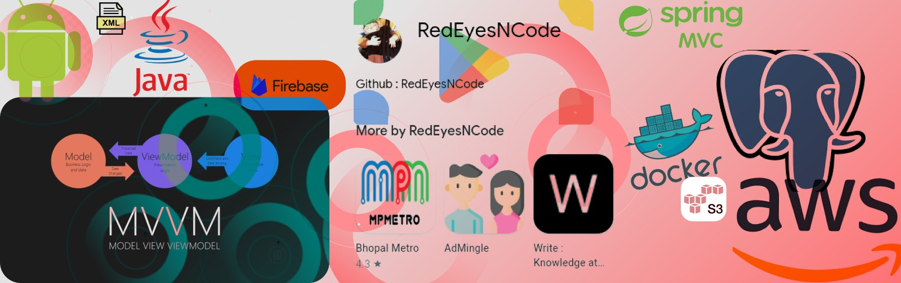

 
 
 # Trading Tonic
💀[Playstore App Link ](https://play.google.com/store/apps/details?id=com.tonictrader.tonictrades)

<table>
  <tr>
    <td>App Screens</td>
  </tr>
  <tr>
    <td></td>
  </tr>
</table>

Android Java Based Application which is published on playstore. This Application Stack contains various design concepts and software development lifecycle principals
## App Concept 

**Traders struggle to provide feedback about when to place a call on the trade this has been done via telegram or whatsapp channels. 
In order to reduce this gap.**

## Android FrontEnd Stack
👉 Made in Year 2021.

👉👉👉👉👉👉

👉👉

# About the Android App

 - This is the Customer App where users come and view the trades given from the admin panel.
 - Contains 4 Options in Bottom Navigation Dashboard. **Home History Chat and Settings**
 
> Home Screen --> Contains the information related to trades given by the admin (**All the stock cards that are added by admin**)
> History --> Contains history of all the trades given from the **Admin App**
> Chat --> Contains Firebase Realtime Database chat logic on this screen **ViewHolder Type Based Adapter is Used for Creating Chat UI**
> Settings --> General Information about the app is placed here **Logout, Policy,Terms,Info etc**

## Requirements (Android & Spring)

| FILES |INFO  |
|--|--|
| google-services.json | This file is needed to order for the FCM Feature to work *place your google-json.file* in the project app directory.
JKS (Optional)  | If you need to generate a release build for this Project you will need to create a new JKS file for that.
|application.yml| For Spring upload the application.yml file in order for the S3 Bucket to start working |--|
| admin-sdk-firebase | You will needing the admin-sdkjson from the your firebase console. (it is used to send fcm notifications to front end user) |

## About Spring App

The spring app is should be hosted on Amazon EC2 Instance server inside a **Docker Container** with database set as postgres

 - The Spring App Follows MVC Artitecture to the best practice for managing microservices.
 - Uses Postgres database
 - Amazon S3 Bucket Integerated
 - Firebase Notification Integerated

## API's Endpoints 
|  RequestType| RequestName  |Request Endpoint|
|--|--|--|
| POST | check-user-unique |`{{TonicEndPoint}}api/v1/check-user-unique?email=ashutosah@gmail.com&number=123452267`
|POST	|registerUser| `http://localhost:6767/api/v1/signup`|
|GET|userdetail| `{{localhost}}api/v1/userdetail?userId=3`
|GET|loginUser|`http://localhost:6767/api/v1/loginUser?email=123@gmail.com&password=123456`|
|GET|getTradesHistory|`http://13.235.156.27:6767/api/v1/getHistory`|
|POST|updateTradeData|`{{TonicEndPoint}}api/v1/updateTradeData`|
|POST|giveTrade|`{{TonicEndPoint}}api/v1/tradeData`|
|POST|addRemoteTrade|`{{TonicEndPoint}}api/v1/addRemoteTrade`|
|GET|getAllRemoteTrade|`{{TonicEndPoint}}api/v1/getAllRemoteTrade`|
|POST|updateRemoteTrade|`{{TonicEndPoint}}api/v1/updateRemoteTrade`|
|POST|deleteRemoteTrade|`{{TonicEndPoint}}api/v1/updateRemoteTrade`|
|POST|uploadTradeImage|`{{TonicEndPoint}}api/v1/uploadTradeImage`|
|POST|uploadRemoteTradeImage|`{{TonicEndPoint}}api/v1/uploadRemoteTradeImage`|
|POST|postFCM|`{{TonicEndPoint}}api/v1/fcm`|
|GET|getFCMTokens|`http://localhost:6767/api/v1/tokens`|
|POST|sendNotificationtoOneUsr|`http://localhost:6767/api/v1/notification/token`|
|GET|sendNotificationAll|`http://localhost:6767/api/v1/sendAll`|
|POST|sendImageNotification|`{{TonicEndPoint}}api/v1/sendImageNotification`|
|POST|notificationCustom|`http://localhost:6767/api/v1/notificationCustom`|
|POST|deleteTradeHistory|`{{TonicEndPoint}}api/v1/deleteHistory?id=2`|
|POST|crudHistory|`{{TonicEndPoint}}api/v1/crudHistory`|
|POST|uploadToEC2|`{{TonicEndPoint}}api/v1/uploadToEC2`|
|POST|addFakeTrades|`{{TonicEndPoint}}api/v1/addFakeTrades`|
|GET|getAllUsers|`http://localhost:6767/api/v1/getUsers`|

 - A Trader Using the Admin Trader Android App on this phone can suggest some trades.
 - The User of Playstore app will receive notification and other info with fraction of seconds (`FCM AND FIREBASE REALTIME DATABASE` feels like a socket connection in android)

## License
*Copyright 2023 Ashutosh Singh*

*Licensed under the Apache License, Version 2.0 (the "License"); you may not use this file except in compliance with the License. You may obtain a copy of the License at
[http://www.apache.org/licenses/LICENSE-2.0](http://www.apache.org/licenses/LICENSE-2.0)
Unless required by applicable law or agreed to in writing, software distributed under the License is distributed on an "AS IS" BASIS, WITHOUT WARRANTIES OR CONDITIONS OF ANY KIND, either express or implied. See the License for the specific language governing permissions and limitations under the License.* 

